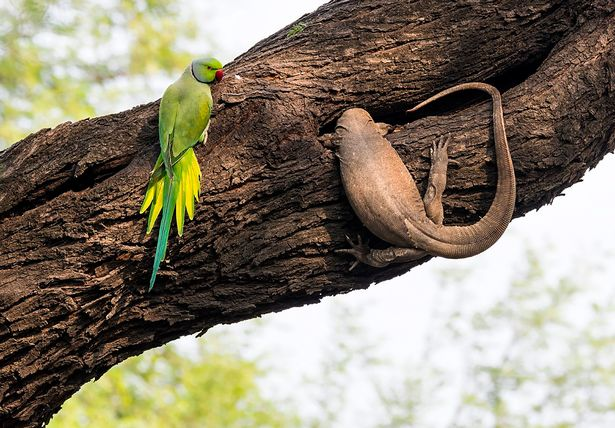
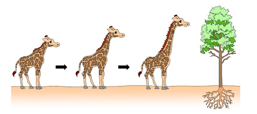
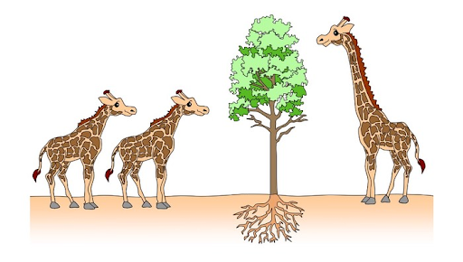
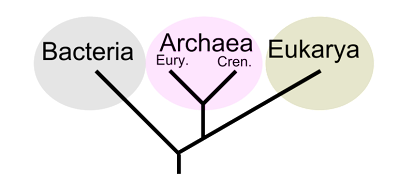
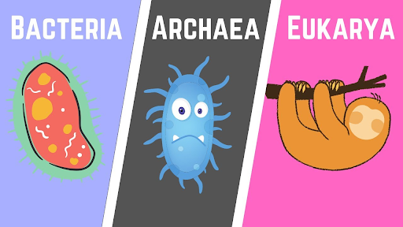
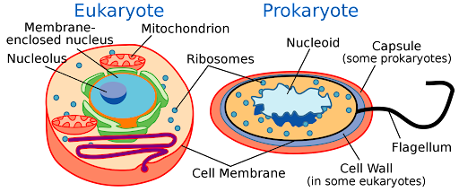
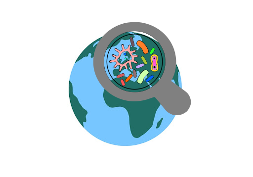
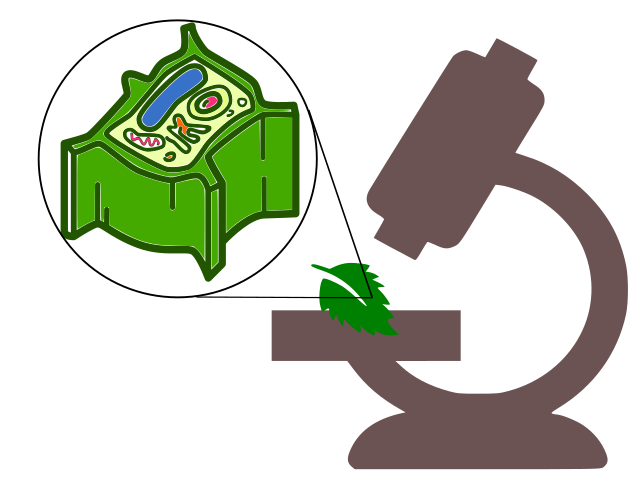
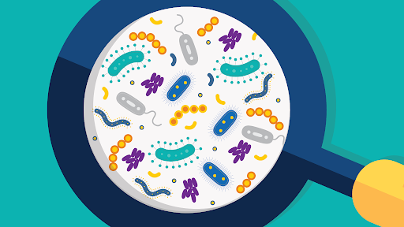

---

### Introduction to the biology

<small><small>[https://www.mirror.co.uk/news/world-news/angry-bird-snapped-trying-protect-10006108]</small></small>

???
- On this planet Earth there are different materials, creatures and forms of life on the earth's surface. 
- Everything that can be found on the earth's surface seems to be connected in one way or the other. 
- Soil, water, air, plants, animals and humans are parts of it.
- I find life in all kinds of forms and it seems to me that organisms are different. 
- But where do these differences come from?
- Why are do small and big organisms exist?
- And what makes all these big and tiny organisms different? 
- I find the answer in the thought that to survive, an organism or animal must adapt well to its environment. 
- If an animal eats insects, they must hunt for them. 
- Their body must have tools for this, such as a beak. 
- Other creatures, such as lizards, have a greenish and brownish body color in order to avoid falling prey to predators.
- Therefore, diverse creatures have different colors and shapes.

---

### Introduction to the biology

<small><small>[https://www.faunesauvage.fr/events/journee-mondiale-de-la-vie-sauvage-6]</small></small>

???
- These differences are probably a matter of trial and error, and the winners are those who survive long enough to produce offspring. 
- And their offspring will also go through the same trial and error process.
- It could only take one generation with one mutation, which provides some survival benefits, in order to make the leap that will ensure the existence of this animal in the population.

---

### Introduction to the biology

<small><small>[http://www.vce.bioninja.com.au/aos-4-change-over-time/evolution/evolutionary-theories.html]</small></small>

???
- There are two popular theories about evolution - Lamarck’s and Darwin’s.
- Their theories are different because Lamarck thought that organisms changed out of need and after a change in the environment.
- On the other hand, Darwin thought organisms changed by chance when they were born and before there was a change in the environment.
- For example, let’s consider a giraffe's long neck.
- Why is this neck so long?
- Lamarck's theory suggested that the giraffe's original short-necked ancestor repeatedly stretched its neck to reach the higher branches to eat.

---

### Introduction to the biology

<small><small>[http://www.vce.bioninja.com.au/aos-4-change-over-time/evolution/evolutionary-theories.html]</small></small>

???
- Darwin's theory suggests that a giraffe was born with a longer neck by random chance. 
- Long necked and short necked giraffes once existed together, but the long-necked giraffe had an adaptive advantage.
- Having access to more food allowed the giraffe to live longer and reproduce more, ultimately leading to more long-neck giraffes.

---

### Introduction to the biology

<small><small>[https://www.reddit.com/r/todayilearned/comments/13plgk/til_human_dna_is_50_the_same_as_bananas/]</small></small>

???
- Now I understand why all life on earth is related. 
- In other words, if I could travel back in time, I could find a common genetic ancestor for any two organisms on earth. 
- It does not matter how different they seem. 
- Even humans and bananas, which humans eat for breakfast, share a distant ancestor. 
- It may seem shocking. 
- But when comparing a human genome to a banana genome, there are so many genes that are similar within the two organisms. 
- Although, from the outside they appear to be very different organisms. 
- Thinking about what humans do for living and what a banana does, there's a lot of things they do in the same way. 
- A lot of genes are just fundamental to life.
- Since I already learned this, it is not so shocking for me that humans and bananas share the same ancestor.

---

### Introduction to the biology

???
- An ancestor carries genetic information that is still shared by all of its descendants. 
- A way to showcase relationships of different species to each other is called a phylogenetic tree. 
- These trees can depict hypothetical relationships and traits of organisms, genes, or even proteins. 
- A specific form trying to showcase all living organisms is the tree of life.
- At the base of the tree trunk lies that ancestor, the first living organism on this planet. 
- Through the evolution of life over the last 3.8 billion years, new species have emerged, resulting in entire lineages of organisms.
- Every branching point in that tree is a story of remarkable adaptation to an ever-changing world.
- The goal of the tree of life is: try to understand how every species is related to each other. 
- Isn't it fascinating!

---

### Introduction to the biology

<small><small>[https://en.wikipedia.org/wiki/Domain_(biology)#/media/File:Two_domain_tree.png]</small></small>

???
- Now I see that how the tree of life is structured. 
- Based on the first branches of the tree of life I can see that creatures belong to three domains. 
- Domains are a concept of grouping creatures. 
- The three domains are called Archaea, Bacteria and Eukarya. 
- All domains have DNA as a blueprint of life.
- “Domains” are the top-level classification which categorizes life in the most general way. 
- For example, one difference between the domains is if the DNA is stored in a compartment called nucleus or it just lies in a circular form within the cell.
- Eukaryotes, the cell type of the Eukarya domain creatures, have a nucleus. 
- Apart from nucleus, there are other differences between organisms from diverse domains.
- But back to the nucleus.
- The nucleus is part of a cell.
- OK.
- But what is a cell?

---

### Introduction to the biology

???
- Cells are the basic building blocks of all living things. 
- It is the smallest unit that can live on its own and it makes up all living organisms. 
- A eukaryotic cell has three main parts: the cell membrane, the nucleus, and the cytoplasm. 
- The cell membrane surrounds the cell and controls the substances that go into and out of the cell. 
- The liquid inside the cell is called cytoplasm. 
- Different compartments of the cell are surrounded by this cytoplasm.
- One of these compartments is the nucleus.
- The nucleus of a eukaryotic cell is also enclosed with a nuclear membrane, and it contains the majority of the cell's genetic material.

---

### Introduction to the biology

<small><small>[https://www.youtube.com/watch?v=EWjYS-DNIiQ]</small></small>

???
- But the cell types of the domains are all a bit different. 
- I find out that archaea were first classified as bacterias.
- Their appearance from the outside, so their cell type, looks closer to bacterias.
- However other properties are closer to the once of eukaryota.
- Therefore, archaea form a separate domain from bacteria. 
- I find bacteria as prokaryotic organisms most fascinating out of all 3 domains. 
- They are also the smallest creatures on their planet, like I am mine.

---

### Introduction to the biology

<small><small>[https://en.wikipedia.org/wiki/Cell_(biology)#/media/File:Celltypes.svg]</small></small>

???
- Now it is time for me to learn more about cells types of different organisms.
- Cells are of two types: eukaryotic, which for example contain their genetic information enclosed by a membrane called a nucleus.
- Whereas prokaryotic do not have their genetic information enclosed. 
- Prokaryotes are single-celled organisms, while eukaryotes can be either single-celled or multicellular. 
- Moreover, eukaryotic cells have membrane-bound organelles and the cell size is from 10 to 100 micrometres, whereas prokaryotic cell size is smaller - from 0.1 to 5 micrometres.
- Wow, if they are so small how can I look at them?

---

### Introduction to the biology

???
- Let's see.
- I am equipped with a special zoom view tool, which is a very useful tool to investigate the diversity of life. 
- My zoom tool works in the same way as a microscope. 

---

### Introduction to the biology

???
- Unlike terrestrial microscopes, my zoom view tool has three settings in one. 
- The first option allows me to see objects which humans can see with their naked eye. 
- The second setting turns on a light microscope-like vision. 
- The light microscope uses lenses and light, so a normal human eye can see something very small in more detail.
- Finally, the third setting makes me able to see objects available for viewing under a terrestrial electron microscope. 
- For objects that are not even visible with a light microscope, an electron microscope can help humans to look at very tiny objects.

---

### Introduction to the biology

![Logarithmic scale of relative sizes from 0.1 nm to 1 m. The interval from 0.1 to 100 μm corresponds to an electron microscope; an atom, lipids, protein, flu virus, mitochondria, bacteria, plant cell, and animal cell fall into this interval. The section from 10 nm to 10 mm corresponds to a light microscope, this interval includes mitochondria, bacteria, plant cell, animal cell, human egg, and frogs egg. The interval from 100 μm to 1 m corresponds to a naked eye; human egg, frogs egg, chicken egg, ostrich egg, and adult female fall into this interval.](images/micriscope-sizes.png)

<small><small>[https://training.galaxyproject.org/]</small></small>

???
- Light microscopes let us look at objects that are between a millimetre (10-3 m) and  0.2 micrometres (0.2 thousands of a millimetre or 2 x 10-7 m) in size. 
- Whereas, the most powerful electron microscopes allow us to see objects as small as an atom (about one ten-millionth of a millimetre or 1 angstrom or 10-10 m).

---

### Introduction to the biology

???
- For example, if you are curious what a leaf is made from, the best would be to use a light microscope. 

---

### Introduction to the biology

???
- That is because the cell of a plant is in size between 10 and 100 micrometres. 
- However, if you want to go further to investigate this leaf’s proteins or even atoms which size starting from 1 nanometre, then an electron microscope should be used.

---

### Introduction to the biology

<small><small>[https://labblog.uofmhealth.org/lab-report/microbiome-mashup-scientists-align-to-understand-microbes-and-around-us]</small></small>

???
- Looking at life through these microscope-like visions, I am surprised! 
- It turned out, there are different tiny organisms of different colors, sizes, and shapes.

---

### Introduction to the biology

<small><small>[https://www.nikonsmallworld.com/galleries/2018-small-world-in-motion-competition]</small></small>

???
- These organisms are around 1 micrometer in size. 
- They are only visible under a microscope or my microscope-like tool. 
- Thus, they are called microscopic organisms, microbes, or microorganisms.

---

### Introduction to the biology

???
- At this point I already have so many questions from what I have learnt.
- How can one find out where an organism belongs in the tree of life? 
- How is such a tree built? 
- And what is one common thing called DNA in all creatures on earth?
- How does it look like and work? 
- Let’s explore it with me.