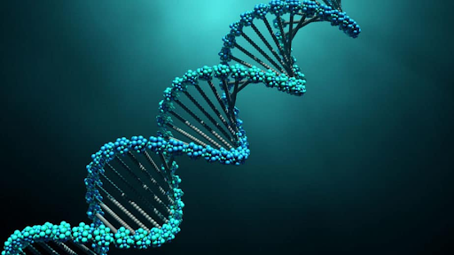
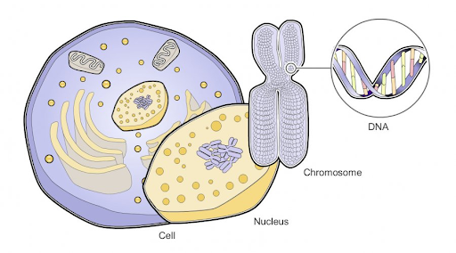
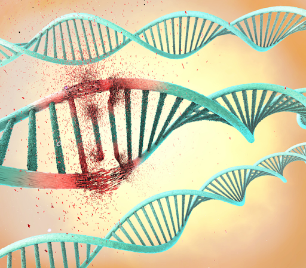
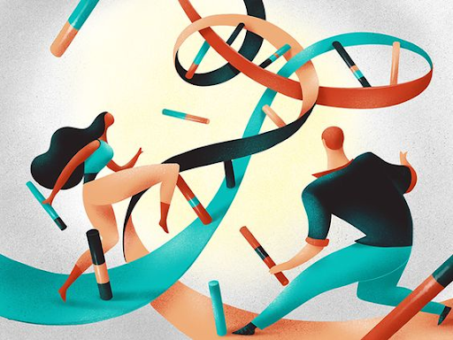
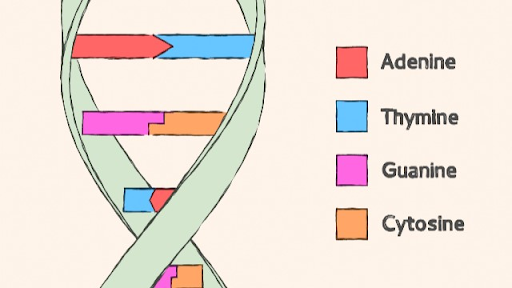

---

### DNA

<small><small>[https://nebula.org/blog/de/dna-desoxyribonukleinsaeure/]</small></small>

???
- DNA is short for deoxyribonucleic acid. 
- DNA is the material that carries all the information about how an organism will look and function. 
- For instance, DNA determines such things as color and shape of an organism and how this organism breathes. 
- All such information is encoded in DNA. 
- Each piece of information is carried on a different section of the DNA. 
- These sections are called genes.
- The DNA is also called genetic information or the building plan of life.

---

### DNA

<small><small>[https://www.yourgenome.org/video/from-dna-to-protein-flash]</small></small>

???
- After learning that DNA exists, I am eager to see this magical thing which carries all the information describing living organisms. 
- Since it is tiny, I have to use my electron microscope vision. 
- It turns out that DNA in eukaryotes is found in structures of the cell called chromosomes. 
- Chromosomes are thread-like structures located inside the nucleus of cells. 
- Each chromosome packs a single molecule of deoxyribonucleic acid (DNA). 
- For the packing processes little helpers, called protein, are needed.
- They are part of the chromosome and situated around the packed DNA.
- I also take a look at prokaryotes.
- The DNA of prokaryotes is organized more loosely and not as densely packed into chromosomes as it is in eukaryotes.

---

### DNA

<small><small>[https://www.clinicalomics.com/topics/translational-research/natural-suppressor-mutations-may-help-protect-us-from-genetic-disorders/]</small></small>

???
- DNA is the blueprint of life, because it includes the instructions needed for an organism to grow, develop, live, and reproduce.
- Proteins are little ‘work horses’, which the cells need for carrying out its function. 
- The genes in DNA transmit physical characteristics from parents to their heirs.
- DNA is a chain of chemical units found in each cell of a living creature. 
- The chemical units are arranged in a particular sequence.  
- Sometimes changes with one unit of the DNA can happen. 
- This is called a mutation. 
- Some of the mutations can have no consequences at all but others can cause diseases and other problems. 
- Mutations are also very important for evolution. 
- A mutation could lead to a better adjustment to a certain condition, like hot weather.

---

### DNA

<small><small>[https://www.pinterest.ru/pin/312648399128435797/]</small></small>

???
- But how does the structure of DNA lool like?
- It is composed of chemicals that are linked together like a chain. 
- Each piece of DNA has two long strands, or chains. 
- The two strands are connected together. 
- They form a shape like a ladder that has been twisted into a spiral.
- Chemicals called phosphates and sugars make up the sides of the ladder, the so-called backbone. 
- There are other  chemical compounds called bases, which bind together, and would form the steps in a ladder.
- Each base on one strand is joined to a base on the second strand.

---

### DNA

<small><small>[https://www.the-scientist.com/daily-news/base-editing-now-able-to-convert-adenine-thymine-to-guanine-cytosine-30706]</small></small>

???
- Did you see that the bases look a bit different?
- I can identify four different bases in DNA.
- They are called: adenine, thymine, guanine, and cytosine. 
- The base combined with other chemicals are called nucleotides and they are repeated in different orders over and over again in each strand of DNA. 
- The order in which the bases are arranged is very important. 
- It forms a code that tells cells to make certain kinds of proteins. 
- The differences in these proteins are what make different living creatures—such as a yeast, a mouse, or two different people.