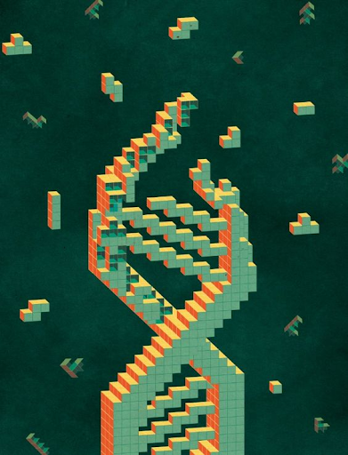
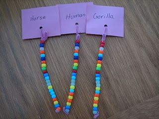
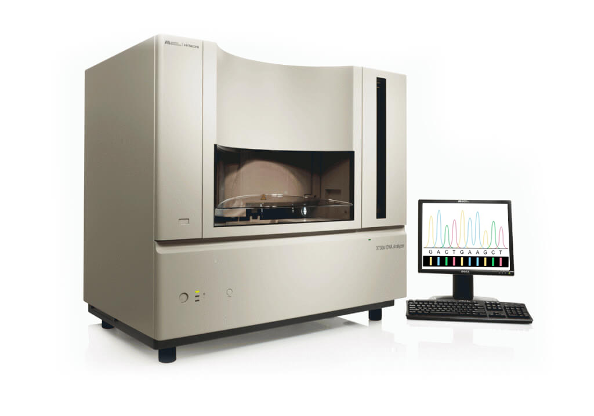
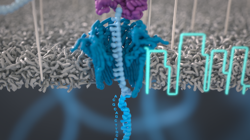
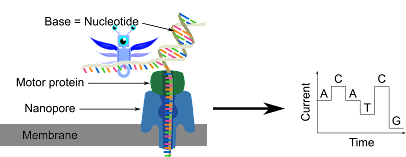
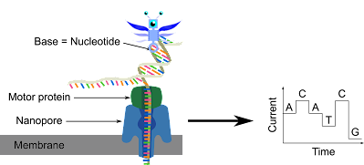
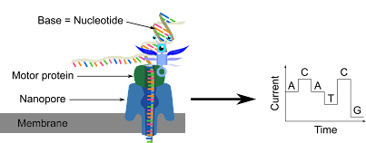
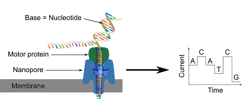
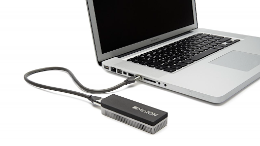

---

### Sequencing

<small><small>[https://www.pinterest.ru/pin/107664247327936161/]</small></small>

???
- I am wondering: can it be determined in which order the nucleotides occur in every type of organism? 
- Is there a way for humans to identify from a piece of material from a specific organism, the sequence of its bases?
- Although I could read the sequence, an automated system would be clever, because reading the whole DNA of e.g. a human which has 6.4 billion letters would take me too much time.

---

### Sequencing

<small><small>[https://www.pinterest.ru/pin/10485011602449279/]</small></small>

???
- There exists a technique for determining the DNA sequence of an organism. 
- This technique is called DNA sequencing.
- Using sequencing one can determine if a DNA stretch originates from a house, human or gorilla just by reading out the sequences of the bases.
- DNA sequencing is the process of determining the nucleic acid sequence – the order of these different nucleotides in DNA. 
- It includes any method or technology that is used to determine the order of the four bases: adenine, guanine, cytosine, and thymine.

---

### Sequencing

<small><small>[https://en.wikipedia.org/wiki/Frederick_Sanger]</small></small>

???
- The first person who determined the sequence was Frederick Sanger. 
- In the 50’s he determined the sequence of amino acids in a protein. 
- He showed the order of the 51 amino acids (the small building blocks of proteins) of the insulin protein, which was never done before.

---

### Sequencing

<small><small>[https://www.starseq.com/life-science/sanger-sequencing/]</small></small>

???
- A bit later, in the early 70’s Sanger developed a method to determine the exact sequence of nucleotides within a gene. 
- This method is called the “chain termination” method. 
- In the same year, another chemical method of DNA sequencing was explained by Allan Maxam and Walter Gilbert. 
- The “chain termination” method is still used in laboratories today for smaller stretches of sequences.
- However, nowadays there are cheaper and less time consuming methods.

---

### Sequencing

<small><small>https://www.pacb.com/blog/the-evolution-of-dna-sequencing-tools/</small></small>

???
- I am impressed by the timeline of the development of sequencing.
- The Sanger method is tedious and time-consuming. 
- Other methods were developed afterwards.
- For example, Illumina sequencing, which is part of the so-called second-generation method,
- Around around 2014 nanopore-based DNA sequencing was developed, which is part of the so-called third-generation sequencing.

---

### Sequencing

<small><small>[https://www.genengnews.com/gen-edge/nanopore-sequencing-the-long-and-winding-road/]</small></small>

???
- Nanopore sequencing is one of the latest methods of DNA sequencing.
- It was developed by Oxford Nanopore and represents a new generation of high throughput sequencing technology. 
- It measures the change in voltage when the DNA is transported across a membrane through a tiny pore. 
- In this picture there are few components: membrane depicted in gray, nanopore in blue, motor-protein in purple, and the DNA strand in light blue.
- A membrane has a simple structure in which proteins can be incorporated.
- The incorporated protein is called nanopore.
- There is a small hole inside this nanopore the size of a nanometer (hence the name nanopore), such that a DNA strand can pass through this hole.
- The basic idea of nanopore sequencing is that in the channel of nanopore there is not so much space.
- Therefore, how much exactly the DNA blocks this channel depends on the nucleotide sequence.

---

### Sequencing

<small><small>[https://streetscience.community/protocols/beer-dna-sequencing/#sequencing]</small></small>

???
- Here you can see the scheme of nanopore sequencing.
- I decide to participate in this process in order to learn more about how it works.
- As I am a tiny guy it is not a problem.

---

### Sequencing

<small><small>[https://streetscience.community/protocols/beer-dna-sequencing/#sequencing]</small></small>

???
- I hook on to DNA. 

---

### Sequencing

<small><small>[https://streetscience.community/protocols/beer-dna-sequencing/#sequencing]</small></small>

???
- I jump onto a motor protein at the time a DNA binds to this motor protein
- The motor protein is used to move DNA forward. 
- In other words, it is an engine which reduces the speed of DNA passing through nanopore.
- It is important to slow down the DNA strand because, otherwise, the electrical signal would be distorted by combining signals of several nucleotides.
- Sitting on the motor protein I start my wonderful journey while the motor protein looks for a nanopore.
- The motor protein is fixed to the nanopore and then opens the double strand DNA, directing one strand through the nanopore in which bases are read one by one. 
 
---

### Sequencing

<small><small>[https://streetscience.community/protocols/beer-dna-sequencing/#sequencing]</small></small>

???
- I jump to the DNA strand because I am curious what is happening with this moving strand.
- When it passes through, the tension on this pore is changed.
- The change in this voltage is specific for each of the four nucleobases, whereby the sequence can be recognized.
- When I am going through the poor I will disturb the signal of the bases. 

---

### Sequencing

???
- A special feature of the offered Nanopore devices is their size. 
- Most of these devices are the size of a Mars bar and can also be connected directly to a computer. 
- In this picture there is a portable real-time device for sequencing called MinION connected to a computer for direct transfer of sequencing data for further analysis.
- Sample preparation can be simplified so that sequencing can also take place outside of a laboratory.