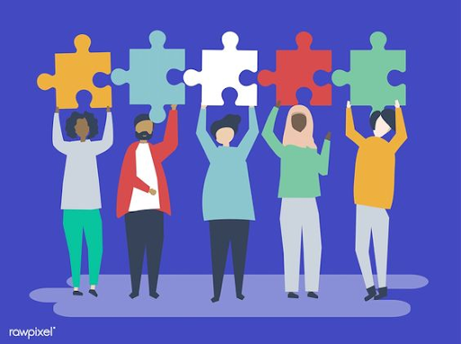
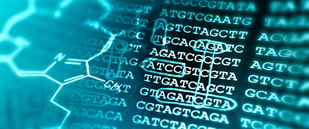

---

### Alignment

<small><small>[https://www.pinterest.ru/pin/439663982367597812/]</small></small>

???
- Thanks to nanopore sequencing, I receive the unique sequence of DNA.
- But what is next to do with this sequence? 
- How to determine the specific organism this DNA belongs to?

---

### Alignment/Mapping

<small><small>[https://marlenechism.com/blog/powerful-forces-intention-alignment/]</small></small>

???
- The answer is to compare this sequence with the so-called reference sequence. 
- It is the sequence which serves as a template. 

---

### Alignment

<small><small>[https://towardsdatascience.com/pairwise-sequence-alignment-using-biopython-d1a9d0ba861f]</small></small>

???
- I can compare sequences by alignment. 
- Sequence alignment is an arrangement of two or more sequences, highlighting their similarity.
- Comparing the sequences it could be that one of the sequences has a different nucleotide in one position. 
- This is called a Mismatch like the C to T in the red box.
- It could also happen that there is no nucleotide in the second sequence to the one in the first like the G in the blue box. This is called a gap.
- Mismatches in the alignment correspond to mutations, and gaps correspond to insertions or deletions.
 
---

### Alignment

<small><small>[https://medium.com/@hasini.dbv/pairwise-sequence-alignment-global-and-local-alignments-5ebacf83c752]</small></small>

???
- Alignment is an important instrument for finding a similarity between two or more sequences
- Due to its semi-conservative duplication mechanism, DNA transmits genetic information from generation to generation. 
- Changes in the material are sometimes caused by errors or mutations in duplication, or by viruses and other mechanisms that move sequences between individuals and within chromosomes. 
- Alignment between sequences indicates that both sequences originated from a common ancestor that contained the matching subsequences. 
- In the case of genetic sequences, it implies that their carriers evolved from a common ancestor.

---

### Alignment

https://phylo.cs.mcgill.ca/play.php - learn more about alignment!

???
- Follow this link to play a fun game where you can learn more about alignment.