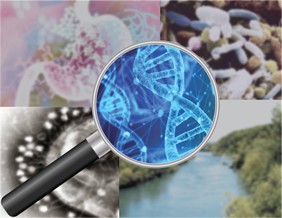
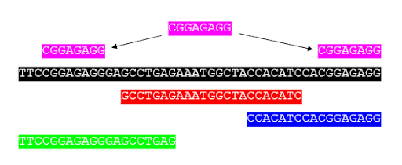

---

### Metagenomics

<small><small>[https://www.healthtech.dtu.dk/english/research/research-sections/section-bioinformatics/group-metagenomics]</small></small>

???
- Now I know enough to work with samples of different creatures. 
- Since I am on earth, I can collect a variety of samples and analyze them. 
- Nevertheless, they are all inextricably linked to their surroundings. 
- A clear sample of one organism is impossible to obtain.
- It looks like a meta genome.
- Luckily there is a solution because there is something called metagenomics. 
- The metagenomics is the type of genetic analyses focused on DNA samples extracted from the environment.

---

### Metagenomics

<small><small>[https://sciwri.club/archives/7530]</small></small>

???
- There are several steps in the metagenomics process, including collecting samples, DNA sequencing, assembly, classifying, annotation, and analysis.
- As you can see in the picture, it is possible to collect samples from different environments - soil, water, the human gut, and even from another planet, such as Sam's planet.
- The samples are sent to a laboratory for DNA extraction and sequencing.
- After obtaining these sequences they can be processed using various technical tools. 
- The sequences are identified by assembling, classifying and annotating them. 
- Afterwards they can be further analyzed.

---

### Metagenomics

<small><small>[https://www.ebi.ac.uk/about/news/feature-story/whats-a-microbiome]</small></small>

???
- Places like soil, air, water, parts of living organisms, and other places can be used as sources of samples.
- Once samples are collected, the second step is DNA sequencing. In this step, short DNA reads will be prepared.

---

### Metagenomics

<small><small>[https://en.wikipedia.org/wiki/Sequence_assembly]</small></small>

???
- Starting from this short DNA reads a metagenomics analysis can be performed. 
- The first step is assembly, in which short reads are made longer by using different assembly algorithms. 
- This longer sequence is called “contigs”.

---

### Metagenomics

<small><small>[https://angus.readthedocs.io/en/2019/recovering-rep-genomes-from-mgs.html]</small></small>

???
- Classifying (or binning) is the second step. 
- Each contig can be assigned to the most appropriate genome.
- At the third step, the so called annotation, the data from the previous steps will be used to annotate.
- Genes can be predicted. 
- Species can be identified.

---

### Metagenomics

???
- Once the first three steps of metagenomics are completed the resulting data can be analyzed. 
- The experts use different tools to analyze data and draw conclusions to answer their research questions.
- I want to learn more about existing metagenomic analysis tools and I also want to analyze the data.
- It is fascinating what different colorful graphs that visually reflect information about the data I can see.
- Would you also want to analyze metagenome data?